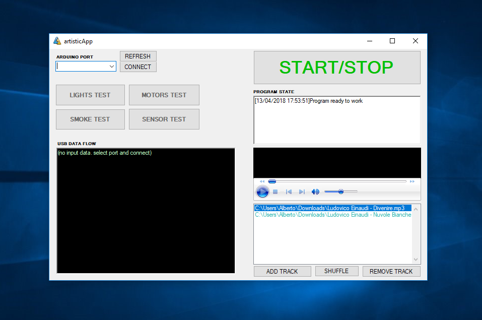
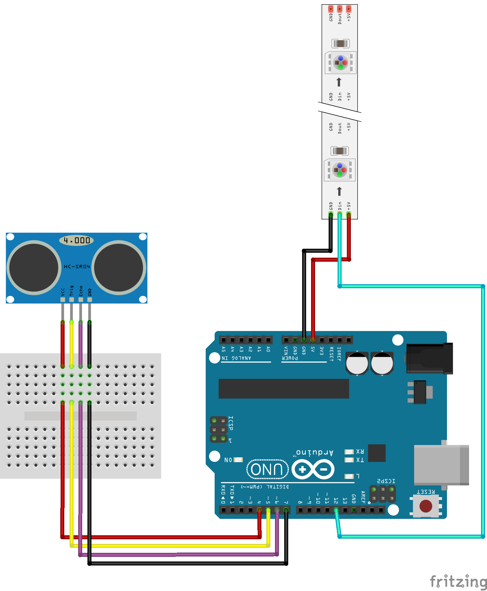

# AI ORACLE Control Design Repository
 Quest'opera è distribuita con Licenza <a rel="license" href="http://creativecommons.org/licenses/by-nc-sa/4.0/">Creative Commons Attribuzione - Non commerciale - Condividi allo stesso modo 4.0 Internazionale</a>.

This repository contains the .ino and C# programs for the control of: AI Oracle installation.
Basically it is a C# .NET interface that communicates serially with Arduino allowing the programmed control of sounds, lights and fog machine.
 You can find more information about the installation itself at: @refpage 
 Contacts: Piera Riccio https://www.linkedin.com/in/piera-riccio-96649211a/  

Arduino code thanks: 
  Pololu Robotics and Electronics for led_strip library available here(https://github.com/pololu/pololu-led-strip-arduino) 
  J.Rodrigo for HR-SC04 Ultrasonic Ranging Module(https://github.com/JRodrigoTech/Ultrasonic-HC-SR04 - http://www.jrodrigo.net)
    
For any information regarding the codes you can contact:  
Alberto Macario: alberto.macario@hotmail.it or https://www.linkedin.com/in/alberto-macario

  
## Pictures

